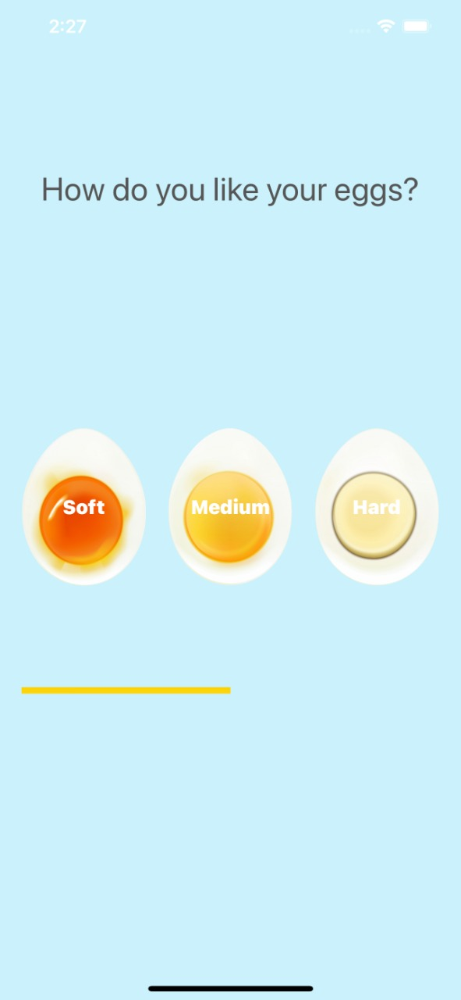
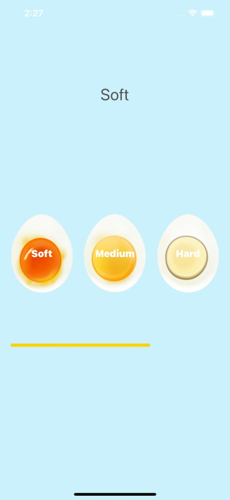
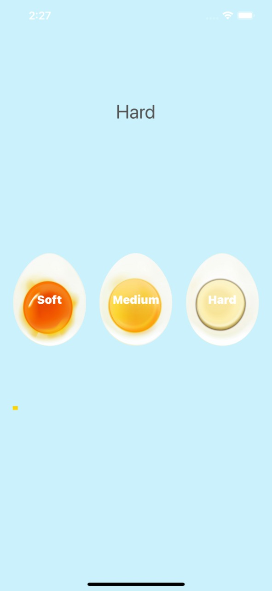

## iEggTimer :tada: :rocket:
Simple app to keep track of time while boiling eggs 

This will take care if you want **SOFT , MEDIUM , HARD** boiled eggs 
This app was as course project while learning iOS development 

## App UI :muscle:
 

PS : The app plays alarm sound , when eggs are boiled as specified time 
